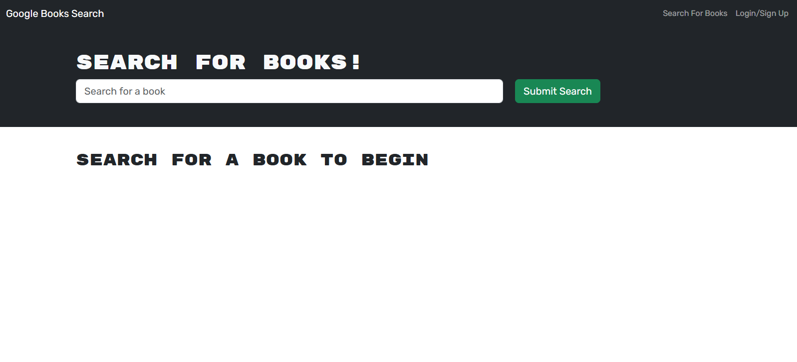
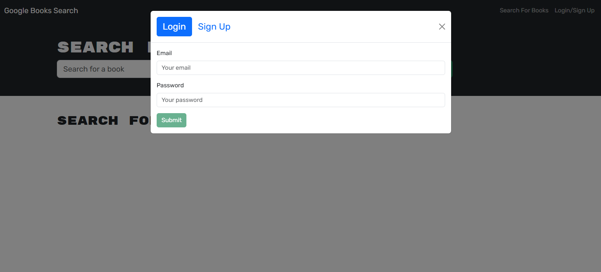
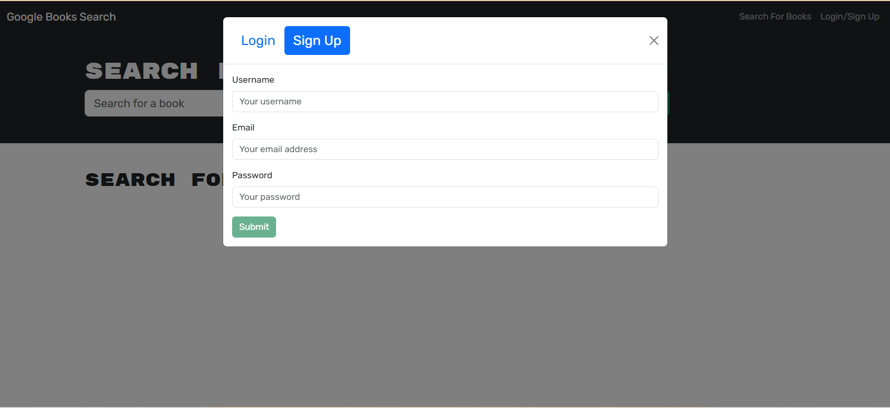
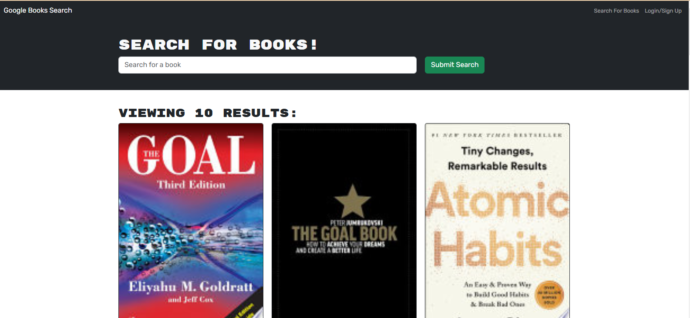
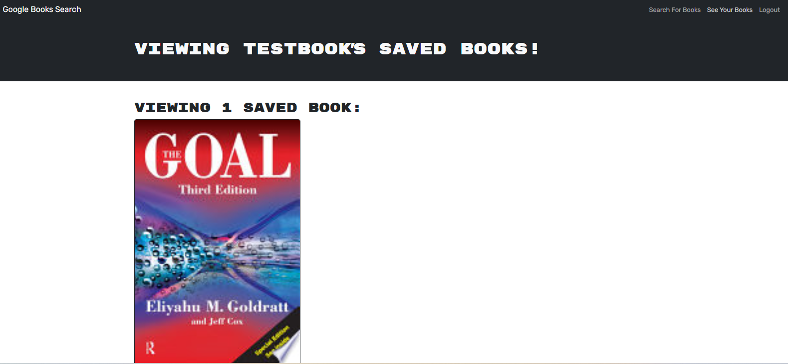

# 📚 Google Books Search Engine

## 🌟 Overview

A full-stack web application that allows avid readers to search for books, save their favorite titles, and manage their reading list seamlessly.

## 📋 Table of Contents

- [Features](#-features)
- [Technology Stack](#-technology-stack)
- [Getting Started](#-getting-started)
- [User Flow](#-user-flow)
- [Screenshots](#-screenshots)
- [Installation](#-installation)
- [API Reference](#-api-reference)
- [License](#-license)

## 🚀 Features

| Feature | Description |
|---------|-------------|
| Book Search | Search for books using Google Books API |
| User Authentication | Secure signup and login functionality |
| Save Books | Save interesting books to personal reading list |
| Manage Saved Books | View and remove saved books |
| Responsive Design | Works on desktop and mobile devices |

## 💻 Technology Stack

| Frontend | Backend | Authentication | API |
|----------|---------|----------------|-----|
| React | GraphQL | JWT | Google Books API |
| TypeScript | Node.js | Apollo Client | Apollo Server |
| React Bootstrap | Express.js | | |

## 🗺️ User Flow

### Authentication
1. User arrives at the application
2. Can choose to login or signup via modal
3. Provides credentials (email/password)
4. Successfully authenticated users gain additional features

### Book Search
1. Enter search term in search input
2. View search results with book details
3. Logged-in users can save books to their list

### Saved Books
1. Access saved books section
2. View personal book collection
3. Remove books from the list as desired

## 🖼️ Screenshots
- Home Page


- Login/Signup Modal



- Book Search Results


- Saved Books Page

## 🔧 Installation

### Prerequisites
- Node.js (v14+)
- npm or yarn
- MongoDB

### Steps
```bash
# Clone the repository
git clone https://github.com/nandyamit/Book-Search-Engine.git

# Navigate to project directory
cd Book-Search-Engine

# Install dependencies
npm install

# Set up environment variables
cp .env.example .env
# Edit .env with your configuration

# Run the application
npm run develop
```

## 🔐 Environment Variables

| Variable | Description | Example |
|----------|-------------|---------|
| `MONGODB_URI` | MongoDB connection string | `mongodb://localhost:27017/booksearch` |
| `JWT_SECRET` | JSON Web Token secret | `your_very_secret_key` |
| `GOOGLE_BOOKS_API_KEY` | Optional Google Books API key | `AIza...` |

## 📡 API Reference

### Authentication Endpoints
- `POST /graphql/login`: User login
- `POST /graphql/signup`: User registration

### Book Endpoints
- `GET /graphql/search`: Search books
- `POST /graphql/save`: Save a book
- `DELETE /graphql/remove`: Remove a saved book

## 📄 License

Distributed under the MIT License. See `LICENSE` for more information.

## 🏆 Acknowledgements

- [Google Books API](https://developers.google.com/books)
- [Apollo GraphQL](https://www.apollographql.com/)
- [React Bootstrap](https://react-bootstrap.github.io/)
